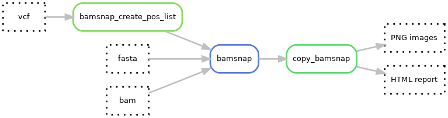
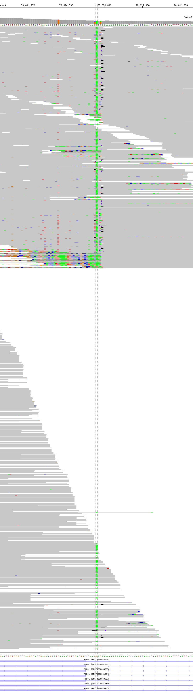

# Bamsnap

[Bamsnap](https://github.com/parklab/bamsnap) is a tool available as a Python package that generates screenshots in IGV for specific positions.
In poppy_uppsala, some adjustments were made to the original code to set up a [custom bamsnap tool](https://github.com/parklab/bamsnap/commit/f4bc661c4e53a6ca21537c98c4f79080d19275bf) 
that is used to generate screenshots of SNVs in the panel of interest.
The custom bamsnap is [containerized](https://hub.docker.com/layers/hydragenetics/bamsnap/0.2.19/images/sha256-934518c699d724a3e949e0855c8ca40a48013e49c93b7d15c6fcf99cd2e41b5a) with Docker.

The settings for bamsnap are such that **automated screenshots** are taken for **SNVs or short indels** which are 
called in the panel and that have a **VAF > 5%**.
This VAF threshold can be adjusted in the configuration files `config_uppsala_>machine>.yaml` under the key 
`[bamsnap][extra]`.
Note that bamsnap is rather slow.
If your sample has many variants, it may take a while to run and you would need to 
increase the time resource allocation for that rule in the pipeline.
The same applies if you want to run bamsnap a sample that was sequenced at very high coverage e.g. several thousands 
of reads in each position. 
The resources allocation we use can handle samples sequenced at ca. 1200x coverage, given the hardware installed on the 
compute 
server used at CGU.

Example of image produced by bamsnap (the chosen short indel has a VAF of 8.3%):

The screenshots are stored as PNG images in the folder `reports/{sampleID}_{type}_{analysisID}_bamsnap/bamsnap_images/` 
and are also listed in the HTML report `reports/{sampleID}_{type}_{analysisID}_bamsnap/variant_list.html`.